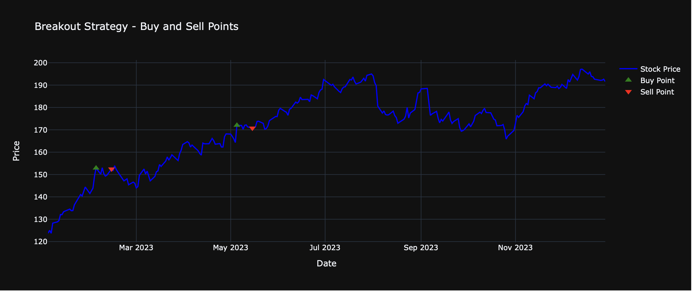

# 📊 **Volume Breakout Analysis Tool**

This project is a **Volume Breakout Analysis Tool** that allows users to identify breakout opportunities in stocks based on volume and price criteria. The tool provides detailed reports, interactive visualizations, and performance metrics for various trading strategies.

---

## 🚀 **Features**

1. **User-Friendly Web Interface**  
   Enter your stock ticker, date range, and breakout criteria through an intuitive interface.

2. **Four Trading Strategies**  
   - **Breakout Strategy**: Buy when volume and price breakout criteria are met.
   - **SMA Crossover Strategy**: Buy when the 10-day SMA crosses above the 50-day SMA.
   - **Breakout Strategy with Risk Management**: Adds stop-loss and take-profit levels to manage risk.
   - **ML Predicted Breakouts**: Uses a Random Forest model to predict breakout days based on technical indicators.

3. **Detailed Reports**  
   - Downloadable CSV containing breakout dates, buy prices, sell prices, returns, and strategy names.
   - Performance metrics: **Win Rate**, **Average Return**, **Maximum Drawdown**.

4. **Interactive Visualizations**  
   - Plotly graphs for each strategy, showing **buy** and **sell points** clearly.

---

## 🎯 **How It Works**

1. **Input Parameters**:  
   - **Ticker**: Stock symbol (e.g., `AAPL`).
   - **Start Date and End Date**: Date range for the analysis.
   - **Volume Breakout Threshold**: Minimum percentage increase in volume compared to the 20-day average (e.g., 200%).
   - **Daily Price Change Threshold**: Minimum percentage increase in price on breakout days (e.g., 2%).
   - **Holding Period**: Number of days to hold the stock after buying (e.g., 10 days).

2. **Generate Report**:  
   - The tool fetches historical stock data from `yfinance`.
   - It calculates breakout days based on user-defined criteria.
   - It evaluates trades based on four strategies and generates a CSV report.
   - Performance metrics are calculated and displayed.
   - Interactive plots for each strategy are generated and shown.

---

## 📦 **Installation**

1. **Clone the Repository**

   ```bash
   git clone https://github.com/nikhilmalkari8/Volume-Breakout-Analysis.git
   cd Volume-Breakout-Analysis
   ```

2. **Create a Virtual Environment**

   ```bash
   python -m venv venv
   source venv/bin/activate       # On macOS/Linux
   venv\Scripts\activate          # On Windows
   ```

3. **Install Dependencies**

   ```bash
   pip install -r requirements.txt
   ```

---

## 🛠️ **Usage**

1. **Run the Flask App**

   ```bash
   python app.py
   ```

2. **Open in Your Browser**  
   Go to: [http://127.0.0.1:5000/](http://127.0.0.1:5000/)

3. **Input Parameters**  
   - Enter the ticker, date range, volume breakout threshold, price change threshold, and holding period.

4. **Generate Report**  
   - Click **"Generate Report"** to download the CSV and view the visualizations.

---

## 📊 **Example Output**

### **CSV Report**

```csv
Strategy,Breakout Date,Buy Price,Sell Date,Sell Price,Return (%)
--- Breakout Strategy ---
Breakout Strategy,2023-02-03,152.89,2023-02-13,152.48,-0.27
Breakout Strategy,2023-05-05,172.03,2023-05-15,170.78,-0.73
```

### **Performance Metrics**

```
Breakout Strategy
Win Rate: 50.00%
Average Return: 1.25%
Maximum Drawdown: 2.50%
```

### **Interactive Plot**



---

## 🧪 **Testing the ML Model**

The tool uses a **Random Forest Classifier** to predict breakout days based on:

- **Close Price**
- **Volume**
- **20-Day Average Volume**
- **10-Day SMA**
- **50-Day SMA**

You can test and improve the model by tuning hyperparameters or adding more features like **RSI** and **MACD**.

This `README.md` provides a clear overview of your project, making it easy for others to understand and use. Let me know if you'd like any modifications!
